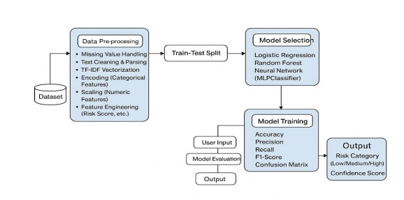
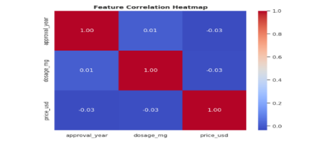
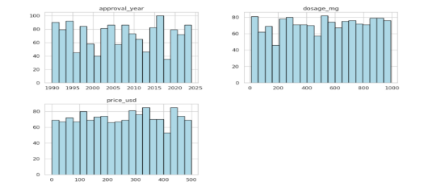
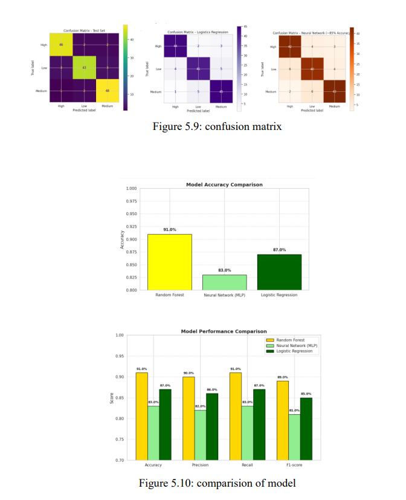
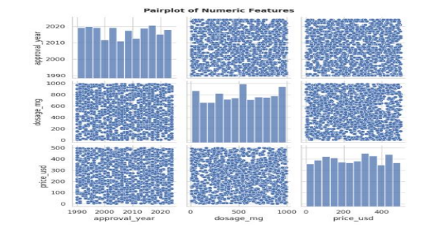
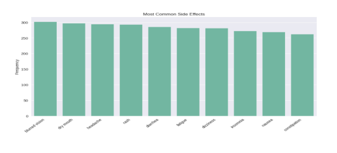
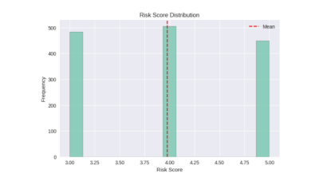

<p align="center">

</p>
<h1 align="center">💊 Dose2Risk — ML Model for Drug Side Effect Risk Classification</h1>
 
<p align="center">
An NLP-driven Machine Learning framework for predicting Adverse Drug Reaction (ADR) risk levels using structured and unstructured pharmaceutical data
</p>
<p align="center">


</p>


# 📌 Repository Highlights
 
- 🧠 NLP + Machine Learning Hybrid Framework
- 🧹 Text Cleaning, Parsing & TF-IDF Vectorization
- 📊 Structured + Unstructured Data Fusion
- ⚖ Class Imbalance Handling using SMOTE
- 🤖 Multi-Model Comparison (RF, Neural Network, Logistic Regression)
- 🏆 Random Forest Selected as Best Model (~91% Accuracy)
- 🧪 Simplified Real-Time Prediction Interface
- 💾 Model Serialization using Joblib
---
 
# 📖 Project Overview
 
Adverse Drug Reactions (ADRs) are among the most persistent challenges in modern pharmacology, contributing significantly to hospital admissions and healthcare costs. Traditional pharmacovigilance relies heavily on structured data and often misses the semantic depth hidden in unstructured text like warning labels and side-effect descriptions.
 
**Dose2Risk** integrates both structured pharmacological attributes (dosage, approval status, drug class) and unstructured textual data (side effects, warnings, contraindications) to classify drug risk into three categories:
 
- 🟢 Low Risk
- 🟡 Medium Risk
- 🔴 High Risk
The project demonstrates a complete ML lifecycle including text preprocessing, TF-IDF vectorization, feature engineering, SMOTE-based balancing, model training, evaluation, and a real-time prediction interface.
 
---
 
# 🎯 Project Objective
 
To develop an integrated machine learning system that accurately predicts drug side-effect risk levels (Low, Medium, High) using both structured pharmacological data and unstructured textual information — supporting safer clinical judgment and pharmacovigilance post-market surveillance.
 
Key objectives include:
 
- Preprocessing structured drug attributes (dosage, approval status, drug class, risk score)
- Extracting features from unstructured text (side effects, warnings, contraindications) using TF-IDF
- Building a unified preprocessing pipeline combining scaling, encoding, and text vectorization
- Implementing and comparing Random Forest, MLPClassifier, and Logistic Regression
- Evaluating models using accuracy, precision, recall, F1-score, and confusion matrices
- Identifying key risk-driving features through EDA and feature importance
- Designing a simplified prediction interface for real-time risk estimation
---
 
# ✨ Key Features
 
✔ Missing Value Imputation
 
✔ Text Cleaning & Regex-Based Parsing
 
✔ TF-IDF Vectorization (side effects, warnings, contraindications)
 
✔ Feature Engineering (risk score, side-effect complexity, years since approval)
 
✔ One-Hot Encoding of Categorical Features
 
✔ Standard Scaling of Numeric Features
 
✔ SMOTE-Based Class Balancing
 
✔ Random Forest, Neural Network (MLP), Logistic Regression
 
✔ GridSearchCV Hyperparameter Tuning
 
✔ Confusion Matrix & Model Comparison
 
✔ Simplified User-Input Prediction Interface
 
✔ Model Serialization (.pkl)
 
---
 
# 🛠 Technologies Used
 
| Category | Technologies |
|------------|-----------------------------|
| Programming | Python |
| Data Analysis | Pandas, NumPy |
| Visualization | Matplotlib, Seaborn |
| NLP | TF-IDF Vectorizer, Regex |
| Machine Learning | Scikit-learn (Random Forest, Logistic Regression, MLPClassifier) |
| Imbalance Handling | Imbalanced-Learn (SMOTE) |
| Model Saving | Joblib |
| Development | Jupyter / Google Colab |
| Version Control | Git & GitHub |
 
---
 
# 📊 Dataset Information
 
**Source:** Kaggle (publicly available pharmaceutical dataset)
 
### Structured Attributes
 
- Drug Name, Manufacturer, Approval Year, Drug Class
- Administration Route, Approval Status
- Dosage (mg), Side Effect Severity
- Price (USD), Batch Number, Expiry Date
### Unstructured Text Attributes
 
- Indications
- Side Effects
- Contraindications
- Warnings
### Target Variable
 
Drug side-effect risk category, engineered from severity and complexity indicators:
 
| Risk Category |
|----------------|
| Low |
| Medium |
| High |
 
---
 
# 🔄 Machine Learning Workflow
 
```text
Dataset (Kaggle)
    │
    ▼
Data Preprocessing
    ├── Missing Value Handling
    ├── Text Cleaning & Parsing
    ├── TF-IDF Vectorization
    ├── Categorical Encoding
    └── Feature Scaling
    │
    ▼
Train-Test Split (Stratified, 80:20)
    │
    ▼
Model Training (with SMOTE)
    │
    ├── Random Forest
    ├── Neural Network (MLPClassifier)
    └── Logistic Regression
    │
    ▼
Model Evaluation
    │
    ▼
Performance Comparison
    │
    ▼
Risk Category Prediction (Low / Medium / High)
```
 
---
 
# 📂 Project Structure
 
```text
Dose2Risk-Drug-Side-Effect-Classification/
│
├── dataset/
│   └── drug_side_effects.csv
│
├── models/
│   └── random_forest_model.pkl
│
├── notebooks/
│   └── Dose2Risk.ipynb
│
├── report/
│   └── Dose2Risk_Project_Report.pdf
│
├── screenshots/
│   ├── Architecture.png
│   ├── Heatmap.png
│   ├── Histogram.png
│   ├── Pairplot.png
│   ├── EDA_Textual_Features.png
│   ├── Confusion_Matrix.png
│   └── Model_Comparison.png
│
├── README.md
├── requirements.txt
├── LICENSE
└── .gitignore
```
 
---
 
# 🤖 Machine Learning Models
 
| Model | Purpose | Accuracy |
|----------|----------------------|----------|
| Random Forest | Ensemble learning, feature importance | **91%** |
| Logistic Regression | Interpretable linear baseline | 87% |
| Neural Network (MLP) | Deep non-linear feature interactions | 83% |
 
🏆 **Best Performing Model:** Random Forest Classifier
 
---
 
# 📈 Results
 
Models were evaluated using accuracy, precision, recall, F1-score, and confusion matrices on a stratified 80:20 train-test split.
 
| Model | Accuracy | Precision | Recall | F1-Score |
|---|---|---|---|---|
| Random Forest | 91% | 90% | 91% | 89% |
| Logistic Regression | 87% | 86% | 87% | 85% |
| Neural Network (MLP) | 83% | 82% | 83% | 81% |
 
Random Forest delivered the most reliable class-level predictions, particularly in distinguishing between Medium and High risk categories.
 
---
 
# 📷 Project Screenshots
 
## 🏗️ System Architecture
 
<p align="center">

</p>
The pipeline covers data preprocessing (missing value handling, text cleaning, TF-IDF, encoding, scaling), model selection, training, and risk category output with confidence scores.
 
---
 
## 📊 Correlation Heatmap
 
<p align="center">

</p>
Visualizes correlation between approval year, dosage, and price — confirming absence of multicollinearity among numeric features.
 
---
 
## 📉 Feature Distributions
 
<p align="center">

</p>
Distribution of approval year, dosage, and price, showing well-varied numerical values supporting an unbiased model.
 
---
 
## 🤖 Model Comparison
 
<p align="center">

</p>
Comparison of accuracy, precision, recall, and F1-score across Random Forest, Logistic Regression, and Neural Network models.
 
## 🧩 Exploratory Data Analysis (EDA)

The dataset was explored through comprehensive Exploratory Data Analysis (EDA) to understand feature distributions, identify missing values, analyze relationships among variables, and extract meaningful insights before model development.


### 📈 Pair Plot Analysis

<p align="center">
  
</p>

The pair plot visualizes pairwise relationships among important numerical features, helping identify trends, clusters, and potential correlations useful for feature engineering.

---

### 💊 Textual Feature Analysis

<p align="center">
  
</p>

---

### ⚠️ Risk Score & Risk Category Analysis

<p align="center">
  
</p>


 
# ⚙ Installation
 
Clone the repository
 
```bash
git clone https://github.com/Lakshmi-TU/Dose2Risk-Drug-Side-Effect-Classification.git
```
 
Move into the project
 
```bash
cd Dose2Risk-Drug-Side-Effect-Classification
```
 
Install dependencies
 
```bash
pip install -r requirements.txt
```
 
---
 
# 📦 Requirements
 
```text
pandas
numpy
matplotlib
seaborn
scikit-learn
imbalanced-learn
joblib
```
 
---
 
# 🚀 Usage
 
Run the notebook
 
```bash
jupyter notebook
```
 
or load the trained model
 
```python
import joblib
 
model = joblib.load("models/random_forest_model.pkl")
 
prediction = model.predict(new_data)
```
 
---
 
# 💼 Skills Demonstrated
 
- Natural Language Processing (TF-IDF, Text Cleaning)
- Machine Learning Classification
- Data Preprocessing & Feature Engineering
- Handling Class Imbalance (SMOTE)
- Exploratory Data Analysis
- Model Evaluation & Comparison
- Pipeline Design (Scikit-learn, ColumnTransformer)
- Python Programming
- Joblib Model Serialization
- Git & GitHub
---
 
# 🚀 Future Enhancements
 
- 🧠 Deep NLP Models (BERT / BioBERT)
- 🏥 Integration with Real-World EHR / FDA Data
- ⚙ Ensemble Stacking & AutoML
- 🔍 Explainable AI (SHAP, LIME)
- ☁ Cloud Deployment
- 📱 Clinical Decision-Support Web/Mobile App
- 🔗 Drug-Drug Interaction Forecasting
---
 
# 👩‍💻 Author
 
## Lakshmi T Unnikrishnan
 
🎓 **M.Sc. Computer Science (Data Analytics)**
 
📍 **Kochi, Kerala, India**
 
### Technical Skills
 
- Python
- SQL
- Machine Learning
- NLP
- Data Analysis & Visualization
- Scikit-learn
- Pandas
- NumPy
---
 
# 📬 Contact
 
📧 **Email:** lakshmi.unnikrishnan26@gmail.com
 
💼 **LinkedIn:** https://www.linkedin.com/in/lakshmi-t-u-b922162ab/
 
💻 **GitHub:** https://github.com/Lakshmi-TU
 
---
 
# ⭐ Support
 
<div align="center">
### If you found this project useful, consider giving it a Star
 
### 🚀 Building AI Solutions for Real-World Problems
 
**Thank you for visiting this repository! ❤️**
 
</div>
<p align="center">
  
</p>
